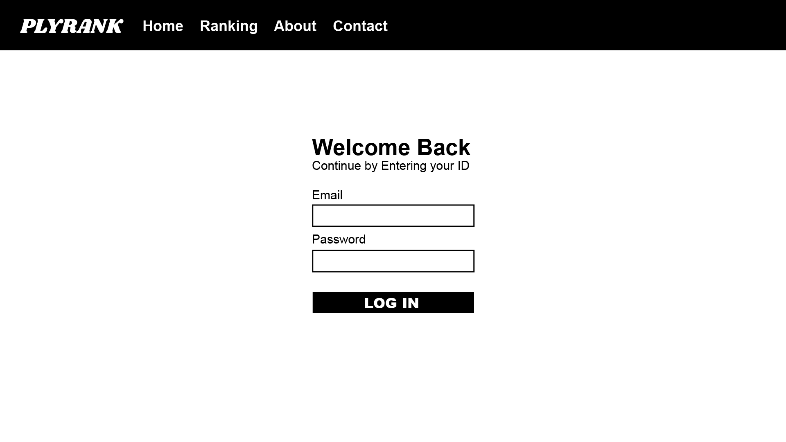
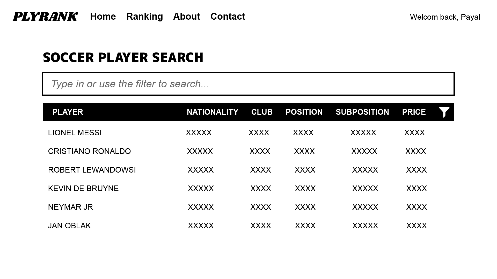
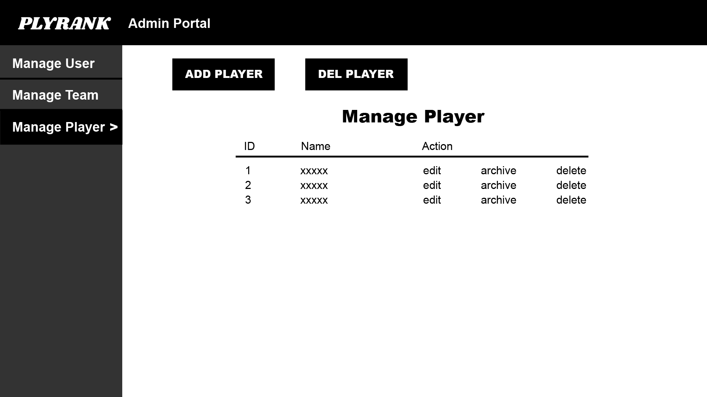

<h1 align="center">PlyRank - Fantasy Soccer </h1>

## Table of contents

- [Project Summary](#project-summary)
- [Description](#description)
- [Usefulness](#usefulness)
- [Realness](#realness)
- [Functionality description](#functionality-description)
- [UI Mockup](#ui-mockup)
- [Work Distribution](#work-distribution)

## Project Summary
A web portal for a fantasy soccer game is a platform that allows users to create their own virtual soccer teams using real-life players and compete against other users' teams . As a part of a database course, the project involves designing a database to store information about users, teams, players, and games. Users can get involved by forming the best teams utilizing player statistics from the past and comparing their own team with the teams of other users. Users interact with our website by logging in to their account, adding and removing players from their team, and viewing individual player statistics.

## Description

Throughout the world there are a multitude of soccer fans who follow each and every game enthusiastically. Many of these soccer fans desire greater connection with their favorite sport. One way this can be made possible is through fantasy soccer, which allows soccer fans to be actively involved in following player performances and making roster decisions. This creates a sense of ownership and investment in their fantasy team. 

Our fantasy soccer web portal will provide a comprehensive platform for users to create and manage their own soccer teams based on real life players. The users will be provided a fixed budget through which they will be able to design their own teams by buying players and creating their formation. A possible stretch goal would be to implement a leaderboard system where users can see where their team ranks against fellow users.

The backend of the portal will be a database of players, which will include their transfer valuations, positions, teams, etc. There will also be a user database which will store each user’s ID and their team information. We will query these databases using MySQL. On the frontend, we will have a web application where the user can create an account, login, view their current team and search for possible players to buy. The frontend will be created using React, which is a flexible JavaScript library used for building interactive user interfaces. We will be connecting our frontend with our DB using Java and SpringBoot APIs. 

## Usefulness

This project will be useful for soccer fans who are interested in forming their own virtual soccer teams and competing against others. Users will be able to demonstrate their knowledge of soccer players and tactics, while staying up-to-date with the most recent player statistics. Our website provides search functionality for players based on their statistics including name, position, rating, base price, etc. and aggregation functionality for the formation of teams. 

Many fantasy leagues for sports exist including Fantasy Premier League and ESPN Fantasy Soccer, but we are implementing a version of fantasy soccer where there is no preseason draft and all players are available to each user. Instead, users will be working with a set budget that limits the quality of the players that can be put on a single team.

## Realness
The database server will store the below entities:

|   Entity    |   Attributes                 |  
| ----------- | -----------------------------| 
| User        |    userId, name, email, password, role, fundsAvailable |
| TeamDetails | teamId , userId , createdDate, teamName, points |
| Player      |    playerId, playerName, playerPosition, playerRating, playerBasePrice, Nationality |
| TeamPlayer | teamPlayerId, teamID, playerId, dateAdded |
| Games | gameId, homeTeamId, awayTeamId, homeScore, awayScore , datePlayed, location |

### Data Source Links:   
https://www.kaggle.com/datasets/davidcariboo/player-scores?select=players.csv

The data comes from Transfermarkt, which is one of the largest sports websites in the world. The footballing information we will be using is listed in the link above. The database is updated on a weekly basis.

## Functionality Description
The web portal for a fantasy soccer game will offer a wide range of functionalities to its users.

Firstly, the login screen is displayed and the user is prompted to enter his/her login credentials. 
The admin can add new users to the database. The admin can also delete users from the database. The admin can also update the user details in the database. The admin can also view the list of users in the database. Admin can also view all the teams' details in the database and also view all the players' details in the database. Admin is able to make changes to the current player and team database for updating and maintaining the information provided on the webpage. The admin can choose to archive certain players to make them “inactive”, which is similar to deletion but the player’s data will be kept for observation only.

The general user will see the list of players in his current team as the landing page. He can search for players based on different parameters like name, position, rating , base price etc. The user can add(insert) players to his team, remove(delete) players from his team, update(update) the players in his team and view the players in his team. The user can also manage positions of players in their team to simulate different tactics that may be used in the field. 

With these and other functionalities, the web portal for a fantasy soccer game will provide a comprehensive and engaging platform for users to experience the excitement of soccer and gaming.

## UI Mockup

Login Page is displayed when the user first visits the website. The user can enter his login credentials and login to the website.

Once the user enters his login credentials and is authenticated, the landing page is displayed. The user can then search for players  in the search bar. 

The Admin portal is displayed when the user logs in as an admin. The admin can add new users, delete users, update user details, view all users, view all teams and view all players.

## Work Distribution

- All team members will equally contribute to DB UML diagrams and design.
- Each page will require querying based on concepts from the course. We plan to include Triggers, Stored Procedures and CRUD operations.

| Member | Task |
| --- | --- |
| Payal Mantri | Initial setup of the frontend in React, and work on different UI Pages. |
| Ammar Raza | Creating the frontend User Interface in React, set up devops to host the application|
| Stephen Moy | Setting up the backend database and creating APIs in Java |
| Youhan Li | Setting up the backend user database and connecting the backend with the frontend. Work on setting up authorization |

 ## Final Demo Video
 https://youtu.be/R3xZHhZiULM

 

